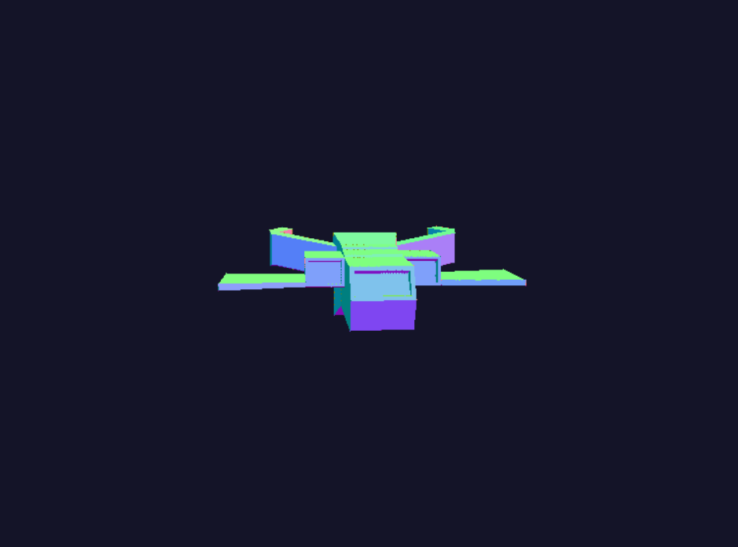

# Software Renderer - Laboratorio de Gráficas por Computadora

Un renderizador 3D por software implementado desde cero en Rust, capaz de cargar y renderizar modelos OBJ con iluminación en tiempo real.

## 📋 Descripción

Este proyecto implementa un motor de renderizado 3D completamente por software (sin usar GPU), que carga modelos 3D en formato OBJ y los renderiza en pantalla usando rasterización de triángulos. Incluye un sistema de iluminación con smooth shading para crear superficies suaves y realistas.

## ✨ Características

- **Carga de modelos OBJ**: Parser personalizado para archivos .obj
- **Rasterización de triángulos**: Renderizado de triángulos usando coordenadas baricéntricas
- **Smooth Shading**: Interpolación de normales para transiciones suaves entre triángulos
- **Iluminación difusa**: Sistema de iluminación que resalta detalles del modelo
- **Rotación interactiva**: Control total de rotación en los 3 ejes
- **Framebuffer personalizado**: Sistema de dibujado pixel por pixel

## 🖼️ Modelo Renderizado


*Nave espacial renderizada con iluminación smooth shading*

## 🎮 Controles

| Tecla | Acción |
|-------|--------|
| `W` / `↑` | Rotar hacia arriba (eje X) |
| `S` / `↓` | Rotar hacia abajo (eje X) |
| `A` / `←` | Rotar a la izquierda (eje Y) |
| `D` / `→` | Rotar a la derecha (eje Y) |
| `Q` | Rotar en sentido antihorario (eje Z) |
| `E` | Rotar en sentido horario (eje Z) |
| `L` | Activar/desactivar iluminación |
| `R` | Resetear rotación a posición inicial |
| `ESC` | Salir de la aplicación |

## 🛠️ Requisitos

- **Rust**: versión 1.88.0 o superior
- **Cargo**: gestor de paquetes de Rust

### Dependencias

```toml
[dependencies]
minifb = "0.27"
nalgebra-glm = "0.18"
```

## 📦 Instalación

1. **Clonar el repositorio**:
```bash
git clone <url-del-repositorio>
cd proyecto2
```

2. **Colocar el modelo OBJ**:
   - Coloca tu archivo `spaceship.obj` en la raíz del proyecto
   - El modelo debe estar en formato OBJ estándar

3. **Compilar el proyecto**:
```bash
cargo build --release
```

4. **Ejecutar**:
```bash
cargo run --release
```

## 📁 Estructura del Proyecto

```
proyecto2/
├── Cargo.toml              # Configuración y dependencias
├── spaceship.obj           # Modelo 3D a renderizar
├── screenshot.png          # Captura del modelo renderizado
└── src/
    ├── main.rs             # Punto de entrada y loop principal
    ├── color.rs            # Estructura de color RGB
    ├── framebuffer.rs      # Buffer de píxeles y operaciones de dibujado
    ├── triangle.rs         # Rasterización de triángulos y smooth shading
    └── obj_loader.rs       # Parser de archivos OBJ y cálculo de normales
```

## 🔧 Componentes Técnicos

### 1. **Framebuffer** (`framebuffer.rs`)
- Buffer de píxeles de 800x600
- Sistema de color de 24 bits (RGB)
- Operaciones de limpieza y dibujado de puntos

### 2. **Cargador OBJ** (`obj_loader.rs`)
- Parser de archivos .obj
- Cálculo automático de normales por vértice
- Triangulación de polígonos con más de 3 vértices
- Normalización y centrado del modelo

### 3. **Rasterización de Triángulos** (`triangle.rs`)
- Algoritmo de coordenadas baricéntricas
- Bounding box optimization
- Smooth shading con interpolación de normales
- Iluminación por píxel

### 4. **Sistema de Renderizado** (`main.rs`)
- Loop principal de renderizado
- Sistema de transformaciones 3D
- Matrices de rotación
- Control de input del usuario

## 🎨 Sistema de Iluminación

El proyecto implementa **smooth shading** (sombreado Gouraud) que:

1. **Calcula normales por vértice**: Promedia las normales de todas las caras adyacentes
2. **Interpola normales**: Usa coordenadas baricéntricas para interpolar entre los tres vértices
3. **Iluminación difusa**: Aplica el modelo de iluminación Lambertiano
4. **Intensidad mínima**: 30% de luz ambiente para mantener visibilidad

```rust
intensidad = 0.3 + 0.7 * max(0, dot(normal, luz))
```

## 🚀 Optimizaciones

- **Compilación release**: Optimización nivel 3 en modo desarrollo
- **Bounding box**: Solo rasteriza píxeles dentro del área del triángulo
- **Target FPS**: Limitado a 60 FPS para rendimiento consistente

## 📊 Especificaciones

- **Resolución**: 800 x 600 píxeles
- **Profundidad de color**: 24 bits (8 bits por canal RGB)
- **Modelo de iluminación**: Difuso (Lambertiano)
- **Tipo de sombreado**: Smooth shading (Gouraud)

## 🐛 Solución de Problemas

### El modelo no se ve completo
- Ajusta el parámetro de escala en `normalize_and_center()` (actualmente 300.0)
- Valores más grandes = modelo más grande en pantalla

### El modelo se ve muy oscuro
- La iluminación usa una luz fija desde arriba-derecha-frente
- Rota el modelo para encontrar el mejor ángulo
- Ajusta la intensidad mínima en el código (actualmente 0.3)

### La rotación es muy lenta/rápida
- Modifica `rotation_speed` en el main (actualmente 0.05)

## 📝 Notas de Implementación

- El sistema usa coordenadas de mano derecha
- Las normales se calculan usando el producto cruz de los bordes del triángulo
- La triangulación de polígonos usa el método de abanico (fan triangulation)
- El archivo OBJ debe usar índices base-1 (estándar OBJ)

## 👨‍💻 Desarrollo

Para modificar el color base del modelo, edita esta línea en `main.rs`:
```rust
let base_color = Color::new(255, 255, 0); // RGB: Amarillo
```

Para cambiar la dirección de la luz:
```rust
let light_dir = nalgebra_glm::normalize(&Vec3::new(0.5, -0.5, -1.0));
```

## 📄 Licencia

Este proyecto fue desarrollado como parte de un laboratorio de Gráficas por Computadora.

## 🙏 Agradecimientos

- Implementado en Rust usando la librería minifb para window management
- Matemáticas 3D con nalgebra-glm
- Basado en los principios de rasterización clásica de gráficos por computadora

---

**Fecha de desarrollo**: Octubre 2025  
**Lenguaje**: Rust 1.88.0  
**Paradigma**: Software Rendering (CPU-based)